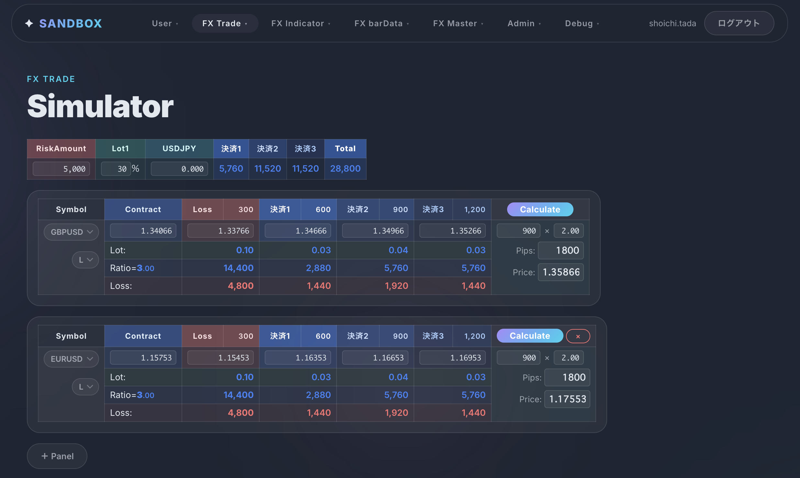
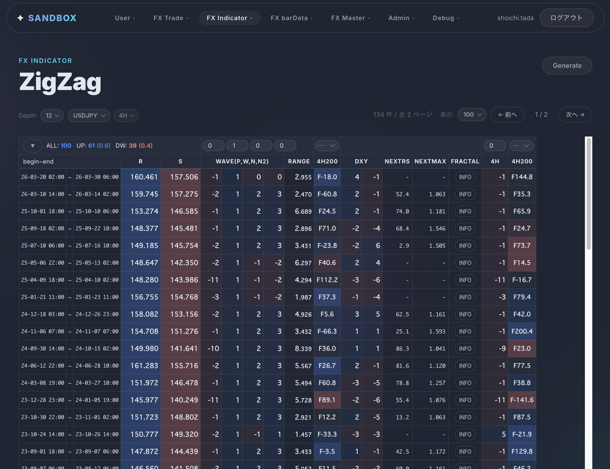
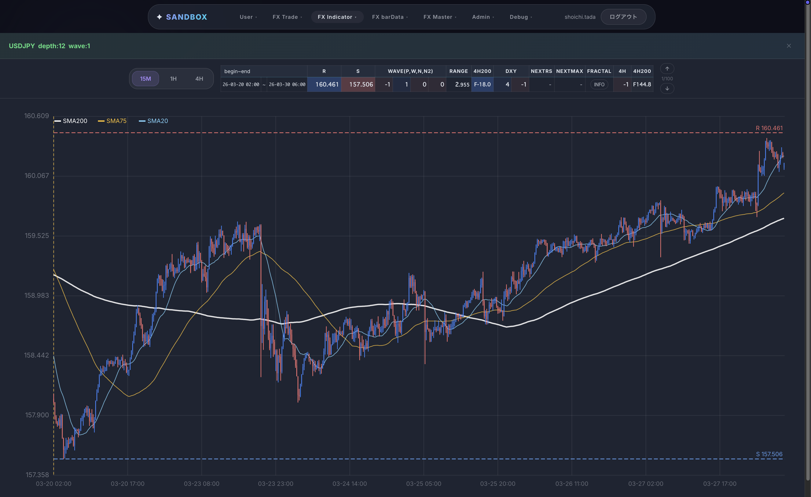
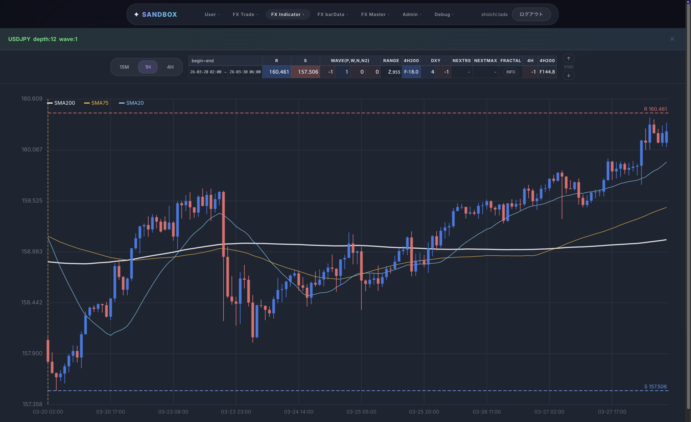
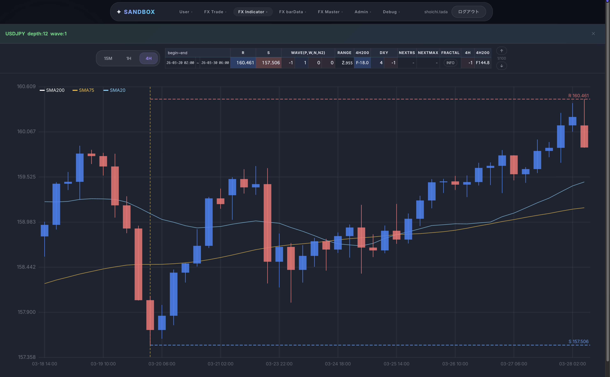

# sandbox-spa-react


FX トレード支援を目的としたフロントエンド SPA。  
AWS Cognito（RS256 JWT）による認証と 3 段階のルートガードを実装し、  
`sandbox-api-springboot` との通信を専用レイヤーに集約することで関心の分離を実現。  
グローバルストアを排除し、Context API + ページローカル state によるシンプルな状態管理を採用。

---

## スクリーンショット

### トレードシミュレーター



### ZigZag 分析






---

## アーキテクチャ

### ディレクトリ構成

```
src/
├── config/          # Amplify などの初期化設定
├── constants/       # 定数定義 (symbolType, barType など)
├── contexts/        # React Context (AuthContext)
├── components/      # 共通コンポーネント
├── hooks/           # カスタムフック
├── router/          # ルーティング設定・Guard コンポーネント
├── pages/           # ページコンポーネント（ルート単位）
│   ├── home/
│   ├── login/
│   ├── user/        # ユーザー登録・プロフィール
│   ├── master/fx/   # マスタ管理（通貨・指標・サマータイム）
│   ├── fx/          # FX データ管理・分析・シミュレーション
│   ├── admin/       # 管理者機能
│   └── debug/       # 開発用デバッグページ
└── sandbox/         # sandbox-api との通信レイヤー
    ├── api/         # API 呼び出し関数
    └── dto/         # リクエスト・レスポンス型定義
```

### 認証フロー

```
サインイン (Cognito)
  └─ JWT 取得 → AuthContext 保持
       └─ sandboxUser 取得 (API)
            ├─ 未登録      → GuardRegistration（登録フロー）
            ├─ 承認待ち    → /pending-approval
            ├─ ブロック    → /error/blocked
            ├─ 承認済み    → GuardMember（一般画面）
            └─ admin=true  → GuardAdmin（管理画面）
```

### ルートガード

| ガード | 条件 |
|---|---|
| `GuardMember` | 認証済み・承認済み・未ブロック |
| `GuardAdmin` | `GuardMember` の条件 + `sandboxUser.admin === true` |
| `GuardRegistration` | 認証済みかつ `sandboxUser` 未登録（初回登録フロー専用） |

---

## 主な機能

| ドメイン | 主な機能 |
|---|---|
| **認証 / Auth** | Cognito サインイン・JWT 自動付与・サインアウト |
| **ユーザー / User** | 初回登録フロー・プロフィール編集（ニックネーム変更） |
| **FX マスター** | 通貨シンボル・国・経済指標・サマータイムのマスタ管理 |
| **FX バーデータ** | OHLC バーデータ一覧・CSV 一括インポート |
| **FX 経済指標データ** | 経済指標データ一覧・テキストインポート |
| **FX ZigZag 分析** | ZigZag 生成・分析一覧（管理者のみ） |
| **トレードシミュレーター** | リスク額・ロット比率・エントリーに基づくシミュレーション |
| **管理者 / Admin** | ユーザー一覧・承認・ブロック・マスタキャッシュリフレッシュ |

---

## 技術スタック

| カテゴリ | ライブラリ / ツール |
|---|---|
| UI フレームワーク | React 18 |
| 言語 | TypeScript 5 |
| ビルドツール | Vite 5 |
| ルーティング | React Router v6 |
| HTTP クライアント | Axios |
| 認証 | AWS Amplify v6 (Cognito) |
| Linter | ESLint 10 + typescript-eslint + eslint-plugin-react-hooks |
| Formatter | Prettier 3 |

---

## Getting Started

### 1. 依存関係インストール

```bash
npm install
```

### 2. 環境変数の設定

`.env.local` をプロジェクトルートに作成し、以下を記入：

```dotenv
VITE_COGNITO_USER_POOL_ID=ap-northeast-1_XXXXXXXXX
VITE_COGNITO_CLIENT_ID=XXXXXXXXXXXXXXXXXXXXXXXXXX
VITE_COGNITO_REGION=ap-northeast-1
VITE_API_BASE_URL=http://localhost:8080
```

### 3. 開発サーバー起動

```bash
npm run dev        # 開発サーバー起動 (http://localhost:5173)
npm run build      # 型チェック + 本番ビルド
npm run preview    # ビルド成果物のプレビュー
npm run lint       # ESLint 実行
npm run format     # Prettier で src/ を整形
```

開発サーバーは `/api/` へのリクエストを `VITE_API_BASE_URL` にプロキシする。

---

## API 通信

`src/sandbox/api/sandboxApi.ts` で Axios インスタンスを生成し、各 API モジュール（`barDataApi.ts`、`countryApi.ts` など）がそれを使って呼び出しを行う。  
Cognito の JWT トークンはリクエストヘッダーに自動付与する。  
レスポンスの `returnCode !== 0` はビジネスエラーとして `showToast` で通知する。

---

## ドキュメント

| 内容 | ファイル |
|---|---|
| 画面一覧・ルーティング・アクセス制御 | [docs/pages.md](docs/pages.md) |
| バックエンド API 仕様 | [docs/api-docs.yaml](docs/api-docs.yaml) |
